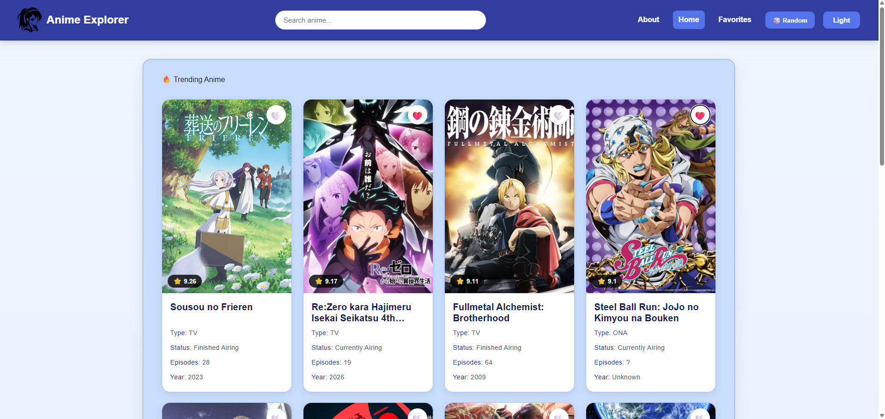
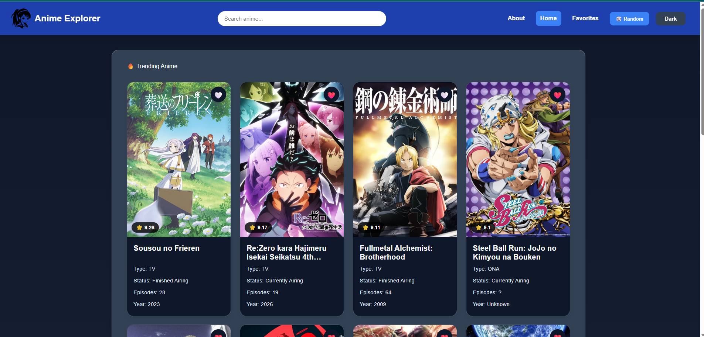
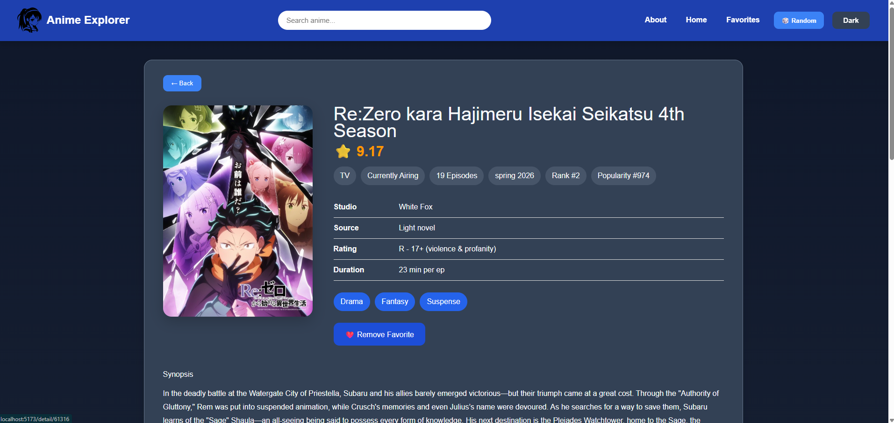
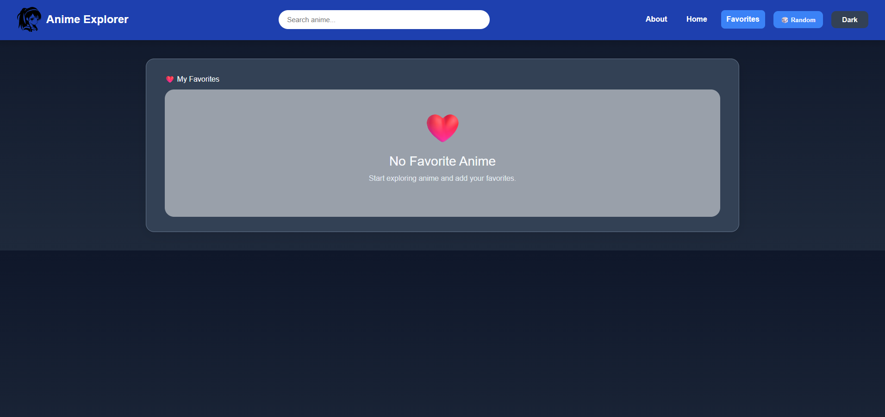
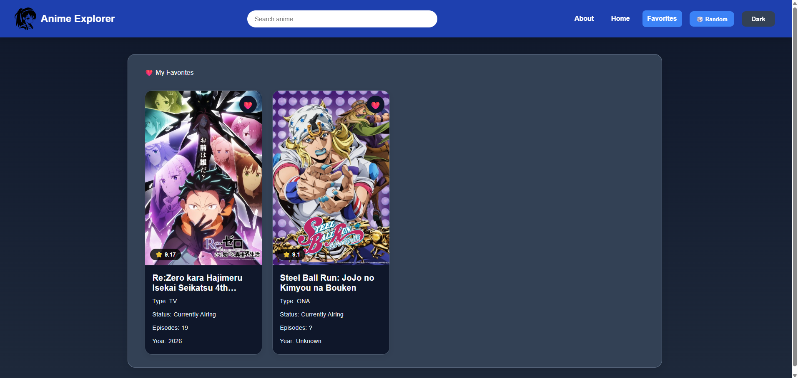

# AnimeToday

A modern anime discovery web application built with **React** and **Vite**, powered by the **Jikan API**. AnimeToday allows users to browse trending anime, search for titles, view detailed information, save favorites locally, and explore recommendations through a clean, responsive interface.

## Features

* 🔥 Browse trending anime
* 🔍 Search anime by title
* 📖 View detailed anime information
* ❤️ Save favorite anime using LocalStorage
* 🎲 Discover a random anime
* ⭐ View anime recommendations
* ▶️ Watch official trailers (when available)
* 🌙 Light / Dark mode
* 📱 Responsive design for desktop and mobile
* ⏳ Loading skeleton animations
* ⚠️ Friendly error handling for API rate limits and server errors

## Technologies

* React
* Vite
* React Router
* Axios
* Jikan API
* LocalStorage
* CSS

## Screenshots
### Home (Light Mode)


### Home (Dark Mode)


### Anime Detail



### Favorites





## Getting Started

### Clone the repository

```bash
git clone https://github.com/NguyenHoangLoc1903/AnimeToday
cd AnimeToday
```

### Install dependencies

```bash
npm install
```

### Start the development server

```bash
npm run dev
```

### Build for production

```bash
npm run build
```

### Preview the production build

```bash
npm run preview
```

## Live Demo

GitHub Pages:

```
https://nguyenhoangloc1903.github.io/AnimeToday
```

## Project Structure

```
src/
│
├── assets/          Images
├── css/             Custom CSS
├── components/      Reusable UI components
├── hooks/           Custom React Hooks
├── pages/           Application pages
├── services/        API functions
├── utils/           Helper functions
├── App.jsx
└── main.jsx
```

## API

This project uses the **Jikan REST API**, an unofficial API for MyAnimeList.

https://docs.api.jikan.moe/

## Local Storage

AnimeToday stores user preferences locally:

* Favorite anime
* Theme (Light / Dark)

No backend or user account is required.

## License

This project was created for learning
